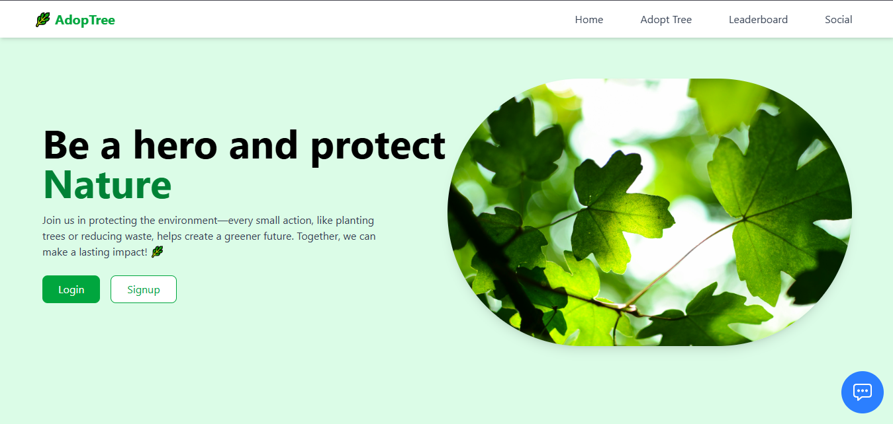

---

# 🌳 Adoptree – Adopt a Tree, Nurture the Planet

Adoptree is a beautifully designed web application built with **React**, **Vite**, and **Tailwind CSS** that allows users to **adopt trees**, track their growth, and contribute to a greener planet.  

Hosted live at: https://adoptree.netlify.app

---

## 🚀 Features

- 🌱 **Adopt a Tree** – Choose a tree to adopt and support its growth.
- 🧾 **Tree Details** – View information about each tree species.
- 📍 **Track Growth** – Visualize your tree's journey as it grows.
- 🪁 **Social media** - Create daily post about your plant and share with others.
- 🤖 **Google Gemini Chatbot Assistant** – Integrated AI chatbot to guide users and answer questions.
- ⚡ **Lightning-fast** – Built using Vite for a blazing-fast development and loading experience.
- 🎨 **Modern UI** – Responsive and clean user interface powered by Tailwind CSS.

---

## 🛠️ Tech Stack

- **React** – For building dynamic UI components  
- **Vite** – Lightning-fast frontend tooling  
- **Tailwind CSS** – Utility-first CSS framework  
- **Google Gemini** – AI chatbot for intelligent assistance  

---

## 📦 Getting Started

### 1. Clone the Repository

```bash
git clon https://github.com/Aaditya-17/tree-adopt2.git
cd adoptree
```

### 2. Install Dependencies

```bash
npm install
```

### 3. Start the Development Server

```bash
npm run dev
```

Your app should now be running at `http://localhost:5173` 🎉


---

## 📸 Screenshots

### 🏡 Home Page

---

## 🙌 Contributing

Contributions are welcome! If you'd like to help improve Adoptree:

1. Fork this repo
2. Create your branch (`git checkout -b feature-branch`)
3. Commit your changes (`git commit -m 'Add new feature'`)
4. Push to the branch (`git push origin feature-branch`)
5. Open a pull request

---
